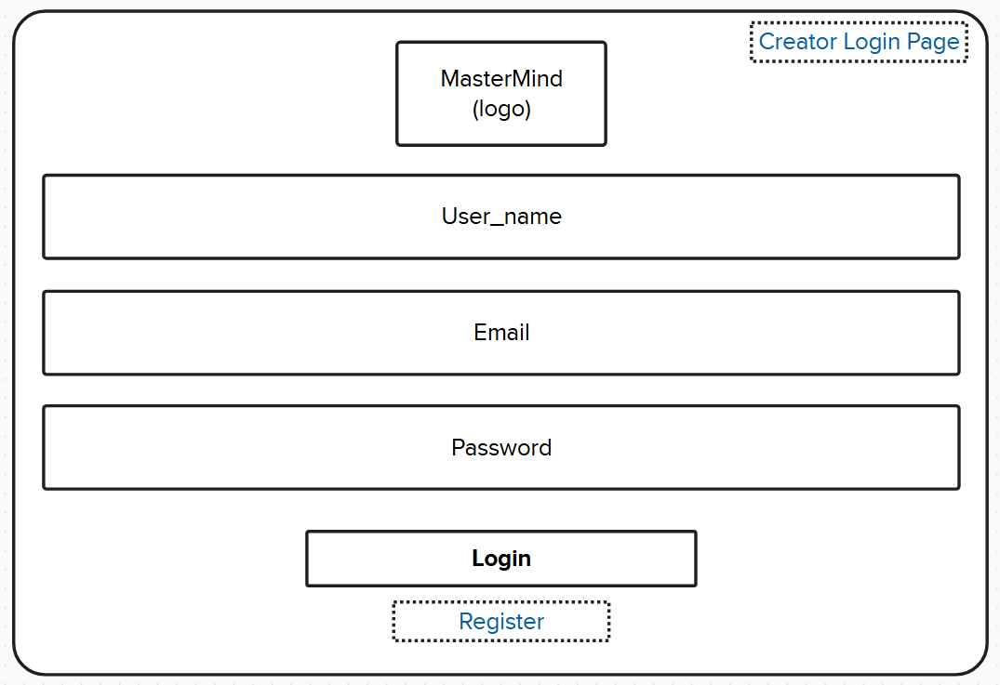
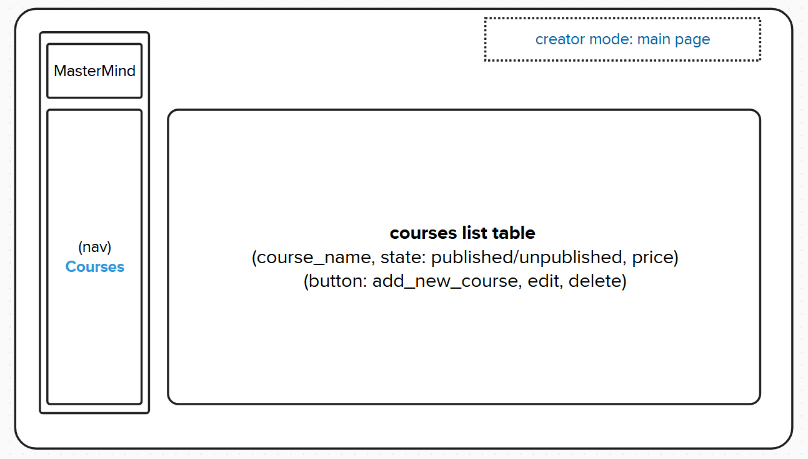
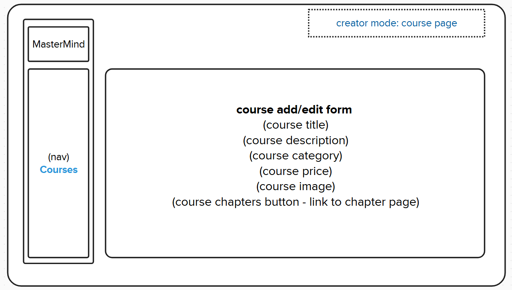
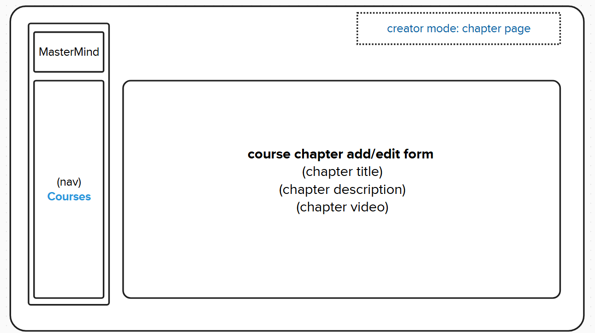
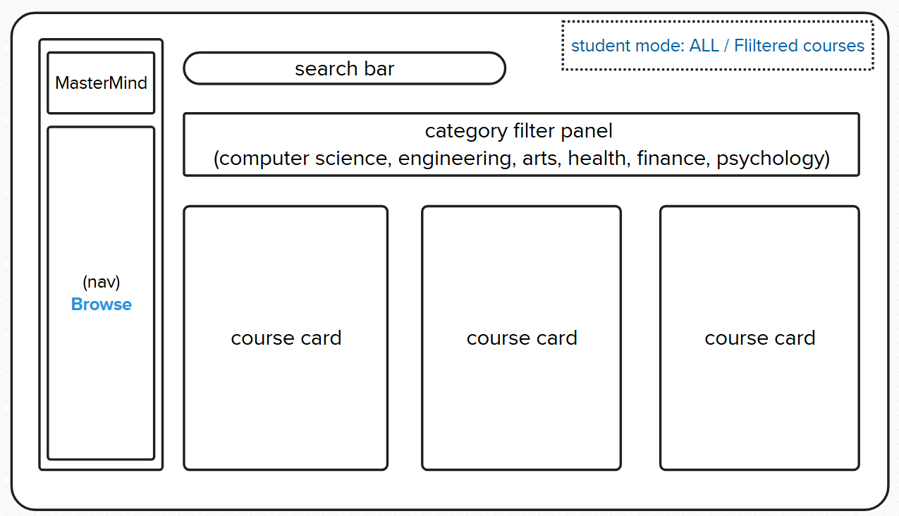
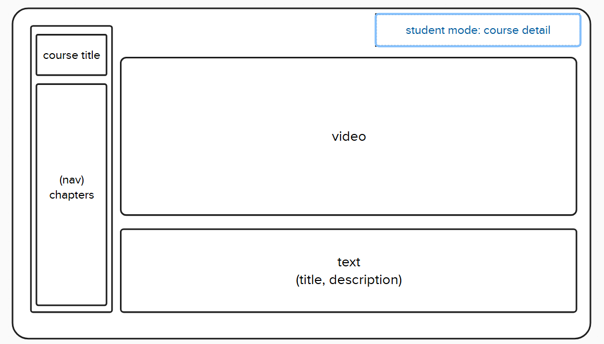

# MasterMind

## Overview

**MasterMind** is an innovative learning management platform tailored for individual creators/ educators
who want to publish and manage online courses. It provides a user-friendly interface for educators
to share their expertise while enabling learners to explore and enroll in courses that align with their learning interest.
This platform is designed to empower independent creators, helping them
build a digital presence as knowledge leaders.

### Problem Space

Many independent educators and subject matter experts lack the technical resources or expertise to create their own learning platforms.

**MasterMind** addresses this gap by providing an all-in-one solution that allows educators to:

- Easily create and manage their content without coding knowledge.
- Offer structured learning experiences with video lessons and supplementary materials.
- Make their content accessible to a broader audience worldwide.

Meanwhile, **MasterMind** offers a centralized platform for learners to:

- Discover new content published by the creator.
- Browse courses and learn at their own pace.

### User Profile

Individual creators who want to share their knowledge with a wider audience without limitation of public platform and expense.
They can:

- Publish and manage online courses.
- Upload video lessons and course materials.
- Categorize and tag courses for better discoverability.
- Modify or delete course content as needed.

## Features

As a creator:

- Publish online courses with structured video lessons.
- Add, edit, and delete courses as needed.
- Assign category tags to courses for easier navigation.
- View and manage published courses in one table list.

As a learner:

- Browse and view published courses.
- Search for courses using keywords.
- Filter courses by category to find relevant content.

## Implementation

### Tech Stack

- Frontend:

  - React
  - React Router
  - Axios
  - SASS

- Backend:

  - Node.js
  - Express.js
  - MySQL
  - Knex.js

- If time permitted:
  - TypeScript
  - Tailwind CSS
  - Next.js
  - Vercel for deployment

### APIs

- No external APIs will be used for the first sprint.

## Sitemap

### For Creators

- Home page: table list for all courses
- Course detail page
- Create new course page
- Edit course page
- Delete course page
- Register/Login (user name + email + password)
- If time permitted:
  - Chapter detail page
  - Create new Chapter page
  - Edit Chapter page
  - Delete Chapter page

### For Learners

- Home page (Browse courses)
- Course detail page

## Mockups

#### For creators:

#### For learners:

## Database Design

- MySQL and Knex.js for tables
- Cloudinary for image and video management, with assets_folder as a backup

### Tables & Relationships

- creators (id, name, email, password)
- courses (course_id, course_name, course_desc, course_price)
- chapters (chapter_id, course_id, course_name, course_desc)

## Endpoints

### User Register APIs

- `POST /api/register` → Register a new user
- `POST /api/login` → Validate user

### Course APIs

- `GET /api/courses` → Browse all courses (students & educators).
- `GET /api/courses/:id ` → View a single course (students & educators).
- `POST /api/courses` → Add a new course (educators)
- `PUT /api/courses/:id` → Edit course (educators)
- `DELETE /api/courses/:id` → Delete course (educators)

### Chapter APIs (if time permitted)

- `GET /api/courses/:id/chapters` → Get all chapters in a course
- `GET /api/chapters/:id` → Get a single chapter
- `POST /api/courses/:id/chapters` → Add a new chapter to a course
- `PUT /api/chapters/:id` → Edit a chapter
- `DELETE /api/chapters/:id` → Delete a chapter

## Roadmap

- Create project with Next.js

  - Use React.js and Express.js as backup
    - Initialize React project
    - Setup routes and basic folders
    - Setup Express.js with routes, middleware, and controller folder

- Database Setup

  - Knex.js for migrations & seeding for users and courses
  - Try: Prisma

- Feature Branches

  - feature-1: try authentication with clerk and complete register and login
  - feature-2: mainpage - navigation
  - Get all courses table list UI
  - Get all courses API
  - Get single course UI
  - Get singel course API
  - Add a new course UI
  - Add a new course API
  - Edit course UI
  - Edit course API
  - delete course UI
  - delete course API

- Fix Branches
- DEMO DAY

## Future Implementations

- Save enrolled courses and track learning progress for students.
- Analytics dashboard to track enrollments and revenue for creators.
